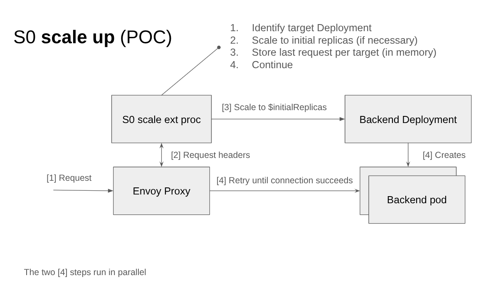
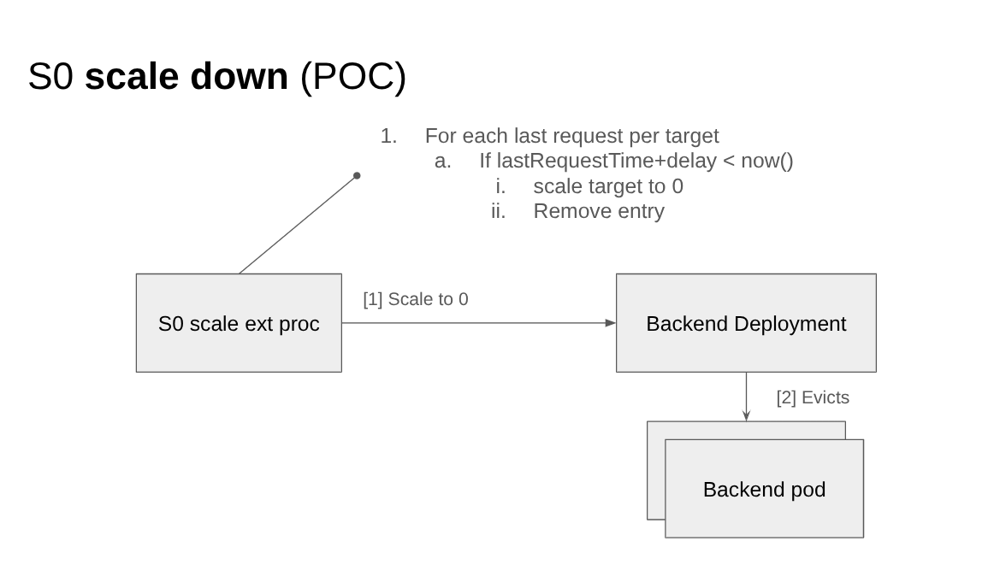

# S0 - A scale to and from 0 system for Kubernetes

> S0 is a prototype and not suitable for production usage, it's meant to demonstrate how scale to and from 0 for HTTP
> traffic can be implemented with a reduced set of components and moving parts when compared to Knative Serving or
> KEDA's http-add-on while leveraging other projects in the ecosystem to compose the full solution (Envoy, etc.).

This project aims to provide a pluggable and composable solution for scaling Kubernetes Deployments from and to zero
based on request traffic. It focuses on minimizing latency during scale-up and offering customizable configuration
options.

## Overview

S0 facilitates efficient scaling of deployments to zero when inactive and quickly scaling them back to a specified
initial replica count upon receiving requests. It allows users to bring their own Ingress, Route, Gateway, Deployment,
or other components, making it highly adaptable to various environments.

### Key Features

* **Scale from/to 0:** Automatically scales Deployments to zero when there are no requests and back to a configurable
  initial replica count when requests arrive.
* **Pluggable and Composable:** Integrates with existing Kubernetes resources, allowing users to bring their own
  components (Ingress, Routes, Gateway, Deployment, CRDs).
* **Configurable Scale Down Delay:** Sets a delay before scaling a Deployment to zero after the last request.
* **Initial Replicas:** Configures the number of replicas to scale up to when a request is received.

## Architecture

S0 leverages an external processor with an Envoy Proxy for request interception. When a request arrives:

1. The external processor identifies the target Deployment.
2. It scales the Deployment to the initial replica count if necessary.
3. The request is forwarded to the backend pod.
4. For scale down, the processor tracks the last request time and scales the Deployment to zero after a configured delay
   if no subsequent requests are received.

### Scale up



### Scale down



## Installation

```shell
kind create cluster --config test/kind.yaml

./install.sh
```

## Test

```shell
kubectl run curl \
  --rm -i -t \
  --image=curlimages/curl:latest \
  --restart=Never \
  --labels="sidecar.istio.io/inject=true" \
  --command -- curl -v http://backend-s0.default.svc.cluster.local
```

After waiting for 1 minute, you should see the backend deployment scaled down to 0:

```shell
$ kubectl get deployments.apps backend
NAME      READY   UP-TO-DATE   AVAILABLE   AGE
backend   0/0     0            0           150m
```

You can emit a new request to see the Deployment scale up to 1:

```shell
$ kubectl run curl \
  --rm -i -t \
  --image=curlimages/curl:latest \
  --restart=Never \
  --labels="sidecar.istio.io/inject=true" \
  --command -- curl -v http://backend-s0.default.svc.cluster.local
* Host backend-s0.default.svc.cluster.local:80 was resolved.
* IPv6: (none)
* IPv4: 10.96.181.200
*   Trying 10.96.181.200:80...
* Connected to backend-s0.default.svc.cluster.local (10.96.181.200) port 80
* using HTTP/1.x
> GET / HTTP/1.1
> Host: backend-s0.default.svc.cluster.local
> User-Agent: curl/8.13.0
> Accept: */*
> 
* Request completely sent off
< HTTP/1.1 200 OK
< x-app-name: http-echo
< x-app-version: 0.2.3
< date: Tue, 27 May 2025 10:59:06 GMT
< content-length: 4
< content-type: text/plain; charset=utf-8
< x-envoy-upstream-service-time: 0
< server: envoy
< 
foo
* Connection #0 to host backend-s0.default.svc.cluster.local left intact
pod "curl" deleted
```

```shell
$ kubectl get deployments.apps backend
NAME      READY   UP-TO-DATE   AVAILABLE   AGE
backend   1/1     1            1           153m

```

## API (proposal)

```yaml
spec:
  initialReplicas: 1    # 0 <-> $initialReplicas
  scaleDown:
    delay: 20m          # Scale down when receiving no requests for 20m
  services:
    - name: backend
  target:
    apiVersion: apps/v1
    kind: Deployment
    name: backend
```

## Implementation details

- Envoy External Processor code is in the [`./ext`](./ext) directory
- Manifests for the prototype are in [`./config`](./config) directory

## TODOs

- Create a controller to configure Envoy dynamically ([example static config](./config/kustomize/envoy-config.yaml))
- Evaluate if S0 and KEDA can be used to together and what are the gaps in the 2 systems to work together
  - S0 for 0 <-> minReplicas
  - KEDA for minReplicas <-> maxReplicas
- Evaluate how to integrate S0 in Istio
- Evaluate HA options
